# Architecture

FinCore is a deliberately small Django application whose consistency boundary
is one PostgreSQL database. The API, idempotency coordinator, transfer service,
ledger writes, and audit event participate in the same local ACID transaction.

```mermaid
flowchart LR
    C[API client] -->|JWT + Idempotency-Key| API[DRF API]
    API --> AUTH[Authentication and authorization]
    AUTH --> IDEM[Idempotency coordinator]
    IDEM --> SVC[Transfer service]
    SVC --> TX[PostgreSQL transaction]
    TX --> LOCK[Ordered account row locks]
    LOCK --> BAL[Ledger-derived balance]
    BAL --> LEDGER[Double-entry ledger]
    LEDGER --> AUDIT[Audit event]
    AUDIT --> COMMIT[Atomic commit]
    COMMIT --> IDEM
    IDEM -->|Stored or new response| C
```



## Transfer sequence

```mermaid
sequenceDiagram
    actor Client
    participant API as DRF API
    participant Auth as JWT/AuthZ
    participant Idem as Idempotency layer
    participant Service as Transfer service
    participant DB as PostgreSQL

    Client->>API: POST /api/v1/transfers/<br/>JWT + Idempotency-Key
    API->>Auth: Authenticate and derive sender
    Auth-->>API: Owned account
    API->>Idem: Normalized request fingerprint
    Idem->>DB: BEGIN; insert unique user/key
    Idem->>Service: transfer_funds(...)
    Service->>DB: SELECT accounts FOR UPDATE ORDER BY id
    Service->>DB: Calculate sender balance from ledger
    alt sufficient funds
        Service->>DB: Create Transaction
        Service->>DB: Create sender DEBIT
        Service->>DB: Create recipient CREDIT
        Service->>DB: Create AuditEvent
        Idem->>DB: Store response; COMMIT
        Idem-->>API: Successful response
        API-->>Client: 201 SUCCEEDED
    else rejected or failure
        Idem->>DB: ROLLBACK
        API-->>Client: Structured financial error
    end
```

## Why PostgreSQL is the boundary

PostgreSQL provides the row locks, uniqueness constraints, foreign keys, check
constraints, and atomic commit needed by this challenge. A successful transfer
does not depend on coordinating separate stores, so there is no distributed
commit gap between a cache, queue, and ledger.

Redis, Kafka, and microservices were intentionally not introduced. They would
add operational and failure modes without improving the correctness of this
single-database internal transfer. If asynchronous integrations are later
needed, a transactional outbox should bridge committed ledger state to external
delivery.

## Module responsibilities

- `accounts`: account ownership, status, currency, and primary-account policy.
- `transactions`: financial intent, transfer orchestration, idempotency, and API.
- `ledger`: immutable-in-principle debit/credit entries and derived balances.
- `audit`: application audit events committed with successful transfers.
- `config`: runtime configuration, health, request IDs, logging, and root URLs.

