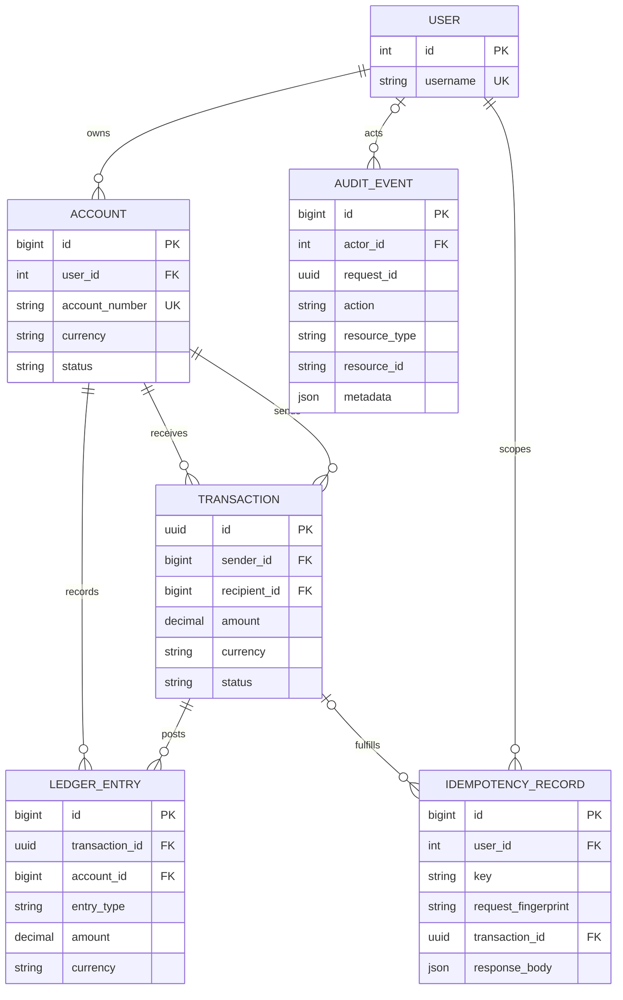

# Database design

## Invariants and deletion policy

- Money uses `numeric(19,2)` through Django `DecimalField`; floats are rejected.
- Transaction and ledger amounts have positive database check constraints.
- A transaction has distinct sender and recipient accounts by database check.
- `(user_id, idempotency_key)` is unique and arbitrates concurrent duplicates.
- Financial foreign keys use `PROTECT`; parent deletion does not cascade history.
- Account balance is not stored. It is credit totals minus debit totals for one
  currency, calculated from ledger entries.

The transfer service creates exactly one debit and one credit for an internal
transfer and checks that their signed sum is zero. Cross-row balance is enforced
by the atomic service because a conventional row-level check constraint cannot
validate a pair of rows. Production reconciliation should independently scan
for missing or unbalanced postings.

The demo bootstrap uses deterministic, balanced treasury allocations because a
production opening-balance/deposit workflow is outside the challenge scope.

